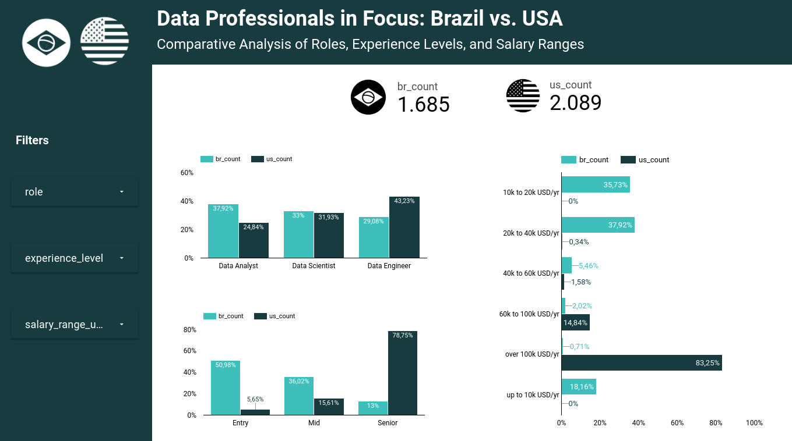
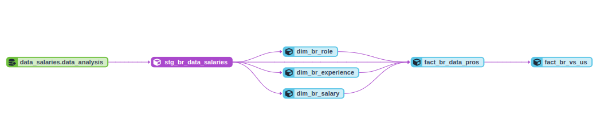
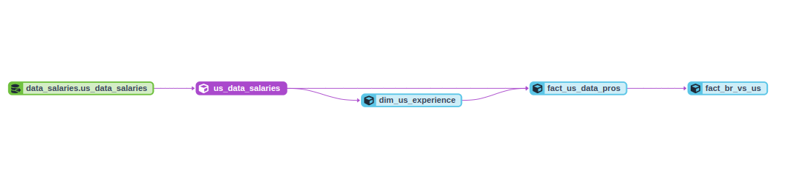
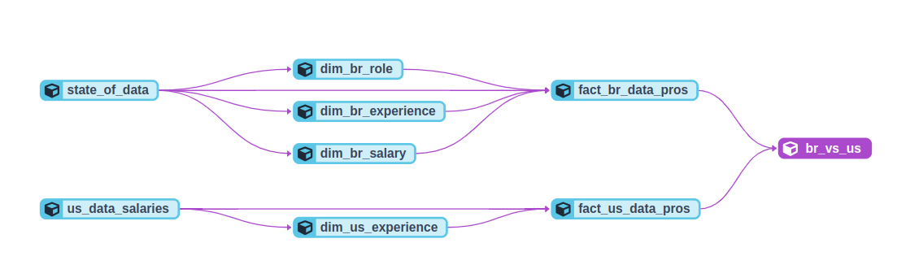
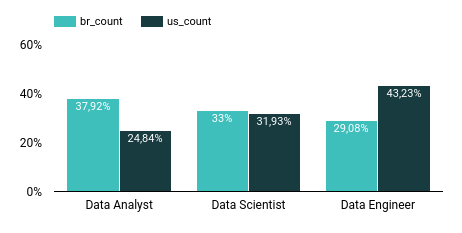
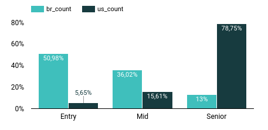
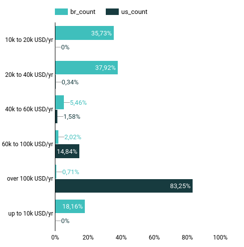

# Data Professionals in Focus: Brazil vs. USA

### Comparative Analysis of Roles, Experience Levels, and Salary Ranges

## 1. Abstract

This project aims to provide a comprehensive analysis comparing data professionals in Brazil and the USA. Through our analysis, we dive deep into various roles, experience levels, and salary ranges, offering insights into the landscape of data professionals in these two countries.

The foundation of our analysis lies in two distinct surveys, both sourced from Kaggle. These datasets were stored and managed within the Google Cloud Platform (GCP). Leveraging the power of BigQuery for data processing and DBT for data transformation, we synthesized and streamlined the data to derive meaningful insights. The culmination of our efforts is visualized in a detailed dashboard crafted using Looker, which provides a comparative view of the data landscape between Brazil and the USA.

[Looker Dashboard](https://lookerstudio.google.com/reporting/3f0617c3-b12a-49b9-8e96-ba30113fccc0)

## 2. Methodology

The data are stored on GCP (Google Cloud Platform) and processed using BigQuery as our Data Warehouse. We utilized DBT (Data Build Tool) for data transformation, organization, and quality checks. Finally, visualizations and dashboards were created using Looker to facilitate data-driven decision-making.

## 3. Business Understanding

### 3.1. Context

With the global demand for data professionals increasing, there's a need to understand the market landscape in different regions. This analysis offers a comparative view of two major markets: Brazil and the USA.

To provide a comprehensive perspective, this study draws from two key data sources:
1. The [State of Data](https://www.kaggle.com/datasets/datahackers/state-of-data-2022) dataset, which gives insights into the Brazilian data professionals' landscape.
2. The [US Data Field Salaries](https://www.kaggle.com/datasets/arnabchaki/data-science-salaries-2023) dataset, which offers a snapshot of the data professionals' scenario in the USA.

### 3.2. Business assumption:

To streamline our analysis and make the initial version of this project more manageable, we made the following assumptions:

1. **Roles in Focus**: We confined our analysis to three primary roles within the data domain:
   - Data Analyst
   - Data Scientist
   - Data Engineer

2. **Experience Levels**: Professionals were categorized into three experience brackets based on their years in the field:
   - **Entry-Level**: 0 to 3 years of experience
   - **Mid-Level**: 3 to 6 years of experience
   - **Senior-Level**: More than 6 years of experience

These assumptions were made to simplify our analysis and provide a clearer, more focused view of the data professionals' landscape in both countries. Future iterations of this project may expand to include a broader range of roles and experience levels.

## 4. Data Analysis

In this section, we will delve into the insights derived from the data, supported by graphical representations. Three primary dimensions were analyzed: job roles, experience levels, and salary ranges.

### 4.1. Job Roles Distribution

The USA has a significant 43.23% of its data professionals classified as Data Engineers, while Brazil has a lesser proportion at 29%. On the flip side, Brazil has a higher concentration of Data Analysts, standing at 37.9%, compared to the USA's 24.85%.

**Analysis**: The higher proportion of Data Engineers in the USA could suggest a more mature data market leaning towards specialized roles, potentially driven by the need for big data expertise, infrastructure management, and advanced analytics solutions. Brazil's dominant Data Analyst population could indicate a market that's still in the phase of understanding and deriving value from data, with advanced specializations like Data Engineering and Data Science still on the rise.

### 4.2. Experience Levels Distribution

A significant difference is observed in the experience levels. The USA boasts a whopping 78% of its data professionals in the Senior bracket. In contrast, Brazil's landscape is dominated by Juniors, constituting 50% of the populace, followed by Mid-level professionals at 36%.

**Analysis**: The high prevalence of Senior professionals in the USA underscores the country's long-standing engagement with data-driven roles, reflecting a mature market with seasoned professionals. Brazil's Junior-heavy demographic suggests a burgeoning market, witnessing a newer influx of individuals entering the data domain, possibly due to recent growth, awareness, and education in data-related fields.

### 4.3. Salary Ranges

When it comes to remuneration, there's a stark contrast. A significant 83% of American data professionals earn above 100k USD annually. In comparison, Brazilian professionals have a more modest earning landscape: 37.9% earn between 20k and 40k USD, and 35.7% earn between 10k and 20k USD annually.

**Analysis**: The salary disparities reflect the economic differences, living standards, and market maturity between the two countries. The USA, with its advanced tech industry, higher cost of living, and mature data market, offers higher salaries. Brazil's emerging market, coupled with a lower cost of living and the influx of newer professionals (as evidenced by the experience distribution), leads to comparatively modest salary ranges. However, it's crucial to contextualize these figures within each country's economic framework to draw fair comparisons.

---

These analyses shed light on the differing landscapes of data professionals in Brazil and the USA, offering valuable insights for businesses, recruiters, and professionals in the field.

## 5. Deployment

Deployed the final datasets to Looker, where dashboards and visualizations were created to provide a comparative view of the data professionals in Brazil and the USA.

[Looker Dashboard](https://lookerstudio.google.com/reporting/3f0617c3-b12a-49b9-8e96-ba30113fccc0)

## 6. Conclusion

The comparative analysis between Brazilian and American data professionals provides illuminating insights into the evolving global landscape of data-driven roles. One of the most striking revelations of this study is the untapped opportunity to consider Brazilian professionals for remote roles in US companies.

Brazil's growing data market, along with the influx of new talent entering the field, means that there is a pool of experienced professionals available at a cost significantly below US market rates. This is not a reflection of the quality or expertise of Brazilian professionals, but rather a consequence of the economic disparities between the two countries.

American companies have a lot to gain by seizing this opportunity. Not only can they achieve substantial cost savings, but they can also benefit from the diverse perspectives and experiences that Brazilian data professionals bring to the table. Additionally, with the remote work model becoming more and more normalized, geographic boundaries are less constrained than ever before.

In essence, as the world becomes more interconnected, forward-thinking companies have a unique chance to optimize their talent acquisition strategy, leveraging the expertise of Brazilian data professionals to drive innovation, efficiency and growth.

## 7. Next Steps
- Stratify the skills data professionals possess in each country.
- Detail other functions of the data area.
- Improve the dashboard design, such as the filter field and the legends and titles of the charts

## 8. References
* [State of Data](https://www.kaggle.com/datasets/datahackers/state-of-data-2022)
* [US Data Field Salaries](https://www.kaggle.com/datasets/arnabchaki/data-science-salaries-2023)
